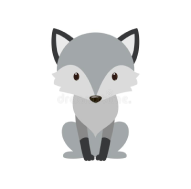

<!-- PROJECT LOGO -->
 

  

  <h3 align="center">Wolf Alarm</h3>

  

     
    <a href="https://github.com/xxychristina/wolfAlarm/issues">Report Bug</a>
    ·
    <a href="https://github.com/xxychristina/wolfAlarm/issues">Request Feature</a>
  

<!-- TABLE OF CONTENTS -->

  
Table of Contents

  <ol>
    <li>
      <a href="#about-the-project">About The Project</a>
      <ul>
        <li><a href="#built-with">Built With</a></li>
      </ul>
    </li>
    <li>
      <a href="#getting-started">Getting Started</a>
    </li>
    <li><a href="#usage">Usage</a></li>
    <li><a href="#design">Design</a></li>
  </ol>

<!-- ABOUT THE PROJECT -->
## About The Project

Wolf Alarm is a safety application that will help users in the situation where they believe that they are being stalked. The voice feature allow user to play pre-recorded audio to fake conversations with another person with the chance of convincing the stalker that the user is not along and has someone nearby. The alarm feature will release a high pitch sound on press to scare away the stalker. Press again to stop the alarm. In future, the map will display not only user current location but also location of the listed emergency contacts, the SOS feature will message all the emergency contacts at once to indicate the user is facing threat and the virtual call feature will bring more realistic phone conversations to scare away the stalker. 

### Built With

* [React Native]
* [Firebase]

<!-- GETTING STARTED -->
## Getting Started

Download expo from app store then scan the barcode inside the link https://expo.dev/@christinaxxy/wolfAlarmApp

<!-- USAGE EXAMPLES -->
## Design
**SOS** and **virtual** are currently **unavailable**.

